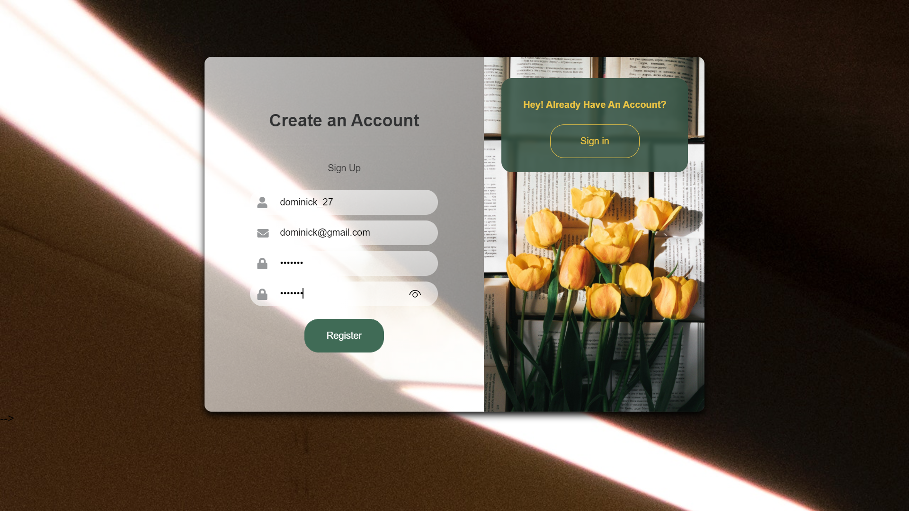

# 
BookBlog

## About The Project

BookBlog is a simple CRUD project to solidify my knowledge of the Flask microframework. The user can add books they've read and rate them.

### In progress:
- [x] The user can register and account and login to their dashboard
- [x] The user can add and update an about me 
- [x] The user can add and rate books  
- [ ] The user can delete or update books or ratings

## Build with:
- Flask
